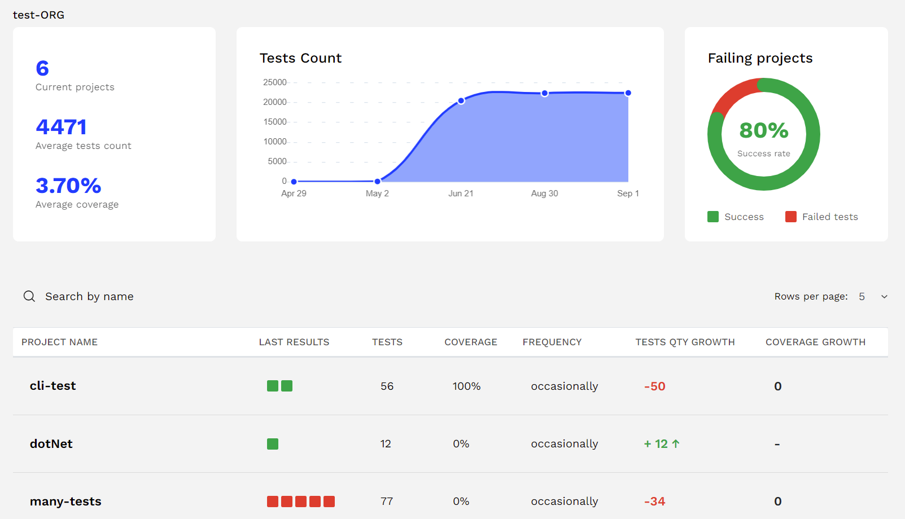
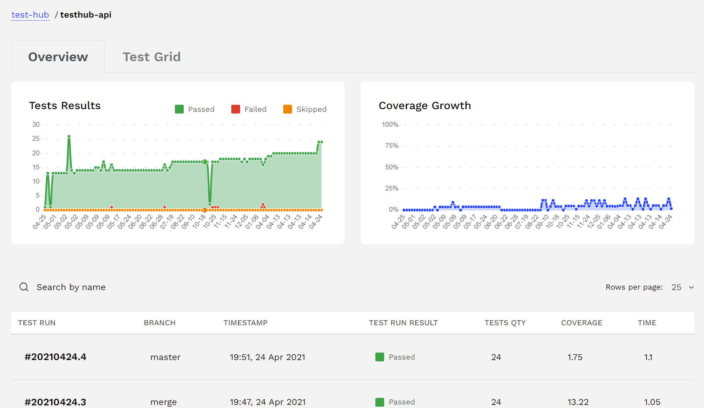
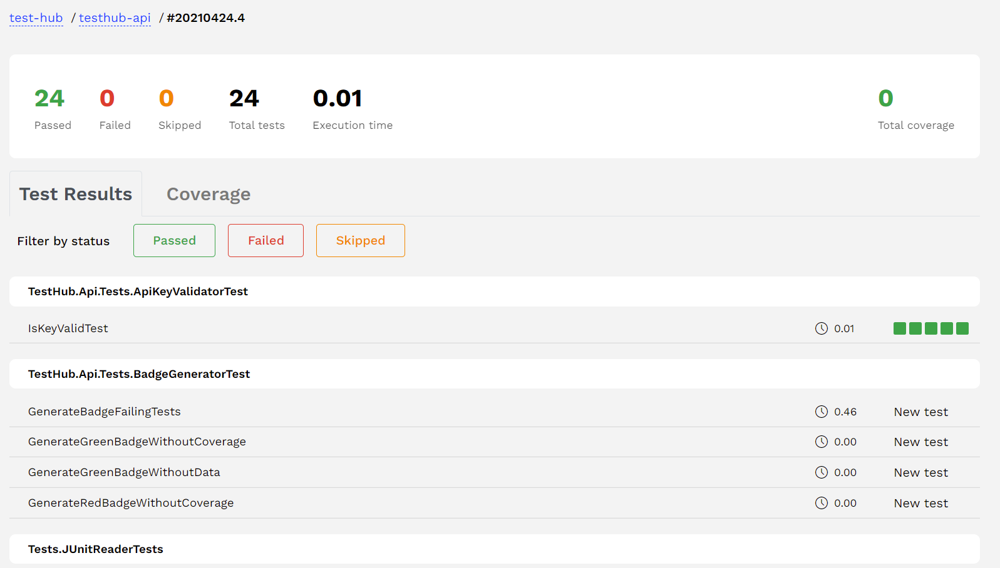
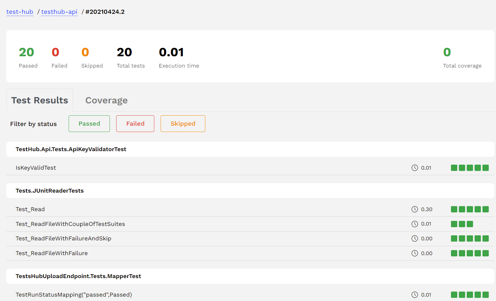

# Testhub

Testhub is a tests results aggregator that makes it easy to upload tests results from CI pipeline and present them in a visual form, provides insightful analytics.

|Organiaztion View | Project View | Test-run View | Testgrid |
|-|-|-|-|
| |  || 

Jump to a demo project and play with interface [https://test-hub.io/testhub-io-examples](https://test-hub.io/testhub-io-examples) 

### Contacts

<p align="left">
    <a href="https://discord.gg/WYx5Ud8eK6">
        </a>              
    <a href="https://t.me/teshub_io">
        </a>
</p>

## 👷 Build Status

[](https://github.com/testhub-io/testhub/actions/workflows/frontend.yml)
[](https://github.com/testhub-io/testhub/actions/workflows/backend.yml)
[](https://test-hub.io/test-hub/projects/testhub-api/runs)&nbsp;


## 🚀 Getting Started

### Managed Testhub 
Testhub have managed version that is hosted on https://test-hub.io. It's free for open source projects. Follow below guide to upload your test results

Check out our [getting started guide](https://testhub-io.github.io/testhub/docs/) to onboatd you project in 5 minutes 

### Self-hosted

#### Helm Charts 
Easiest way to deploy Testhub in Kuberneted cluster in helm-chart package
Here is a guide on how to do it: https://testhub-io.github.io/testhub-helm/

#### Docker 
Dockerhub we "fresh" images: https://hub.docker.com/u/testhubio
Check the [docker-compose.yml](/docker-compose.yaml) to see how to run them togeather 
> Please note that there are two dockerfiles one for "[genera purpose](/frontend/Dockerfile)" and one for [self hosted setup](/frontend/Dockerfile-on-prem.dockerfile). In latter, we override `API_ENDPOINT` env var to make frontend work with hosted backend. Those images have `on-prem` in image tag on dockerhub.

## 👏 Contributing
We love help! Contribute by forking the repo and opening pull requests. Please ensure that your code passes the existing tests and linting, and write tests to test your changes if applicable.

All pull requests should be submitted to the main branch.

### Running Porject Locally
:warning: Please let us know if it tekes you more then 15 minutes to run the project locally. We will work on fixing that. 

#### Dev-container 
Easiest way to run project locally is to use 'dev-containers'
You will need:
-  [VS Code](https://code.visualstudio.com/)
-  [Docker](https://www.docker.com/products/docker-desktop)
-  [Remote Development VS Code Extension pack](https://marketplace.visualstudio.com/items?itemName=ms-vscode-remote.vscode-remote-extensionpack)
I'm pretty sure you already have most of that. 
Then open /frontend or /backend directories in VSCode and reopen them in DevContainer as VsCode suggests. If you did not get suggestion for some reason try `F1-> Remote-Containers: Rebuild and Reopen in Container`


Then hit `F5` and you are done.

#### Docker Compose 

Use `[docker-compose.yml](/docker-compose.yml)' from the root of the project to run dependencies. It consist of 
- DB - `MySQL`
- Backend - `C# .Net Core`
- Frontent - `Vue.js` 

##### Backend
If you work on backend then make sure you set two env vars
```
       ASPNETCORE_ENVIRONMENT: 'Dev'
       CUSTOMCONNSTR_DEFAULTCONNECTION: 'Host=db;Database=testHub;Username=root;Password=password'
```

##### Frontend
For frontend make sure you have your local [conf.js](/frontend/conf.js) pointing to locally running backend like `export default "https://localhost:8090"`

## Contributors 
Thanks, folks 🥇 👏

[](https://github.com/testhub-io/testhub/graphs/contributors)
